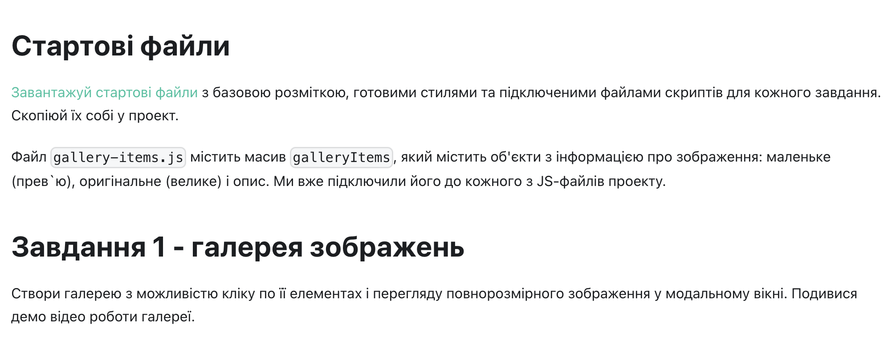
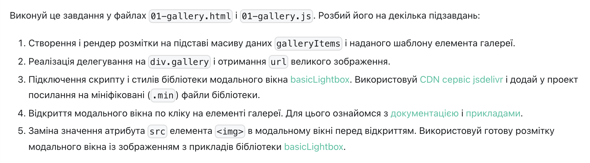
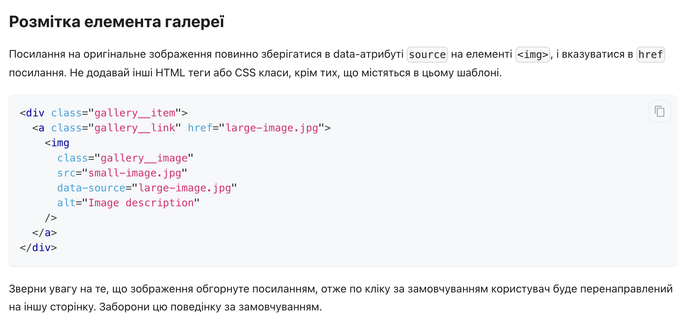
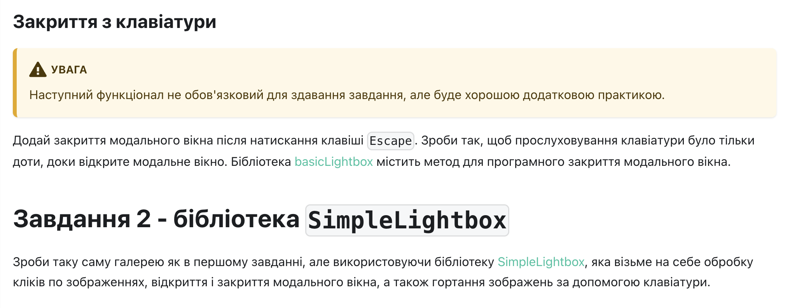
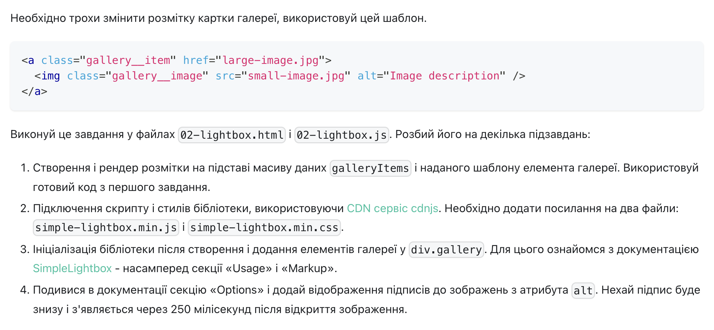

# Критерії приймання

- Створено репозиторій goit-js-hw-07.

- Домашня робота містить два посилання: на вихідні файли і робочу сторінку на
  GitHub Pages.

- В консолі відсутні помилки і попередження під час відкриття живої сторінки
  завдання.

- Імена змінних і функцій - зрозумілі та описові.

- Код відформатований за допомогою Prettier.

